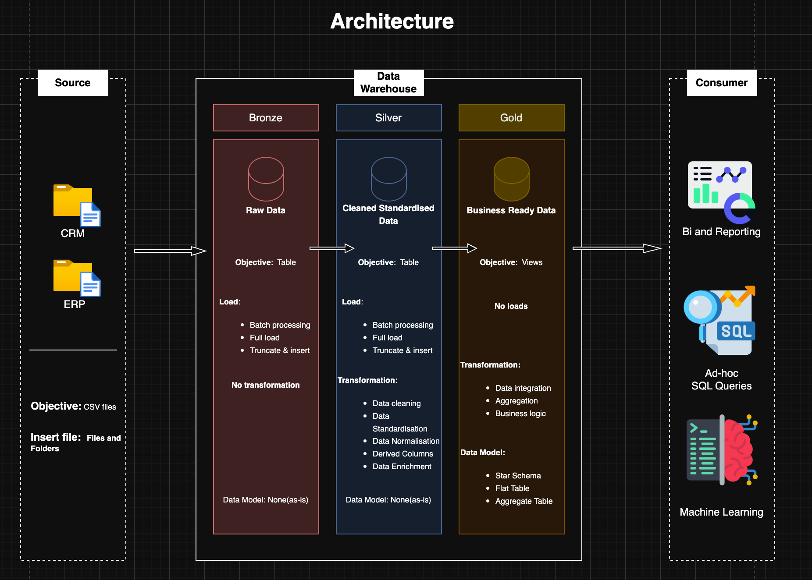
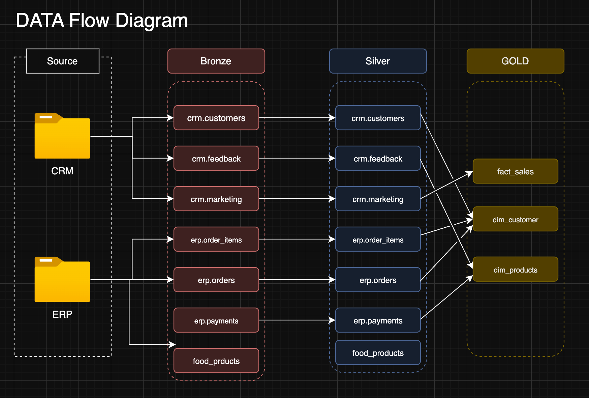
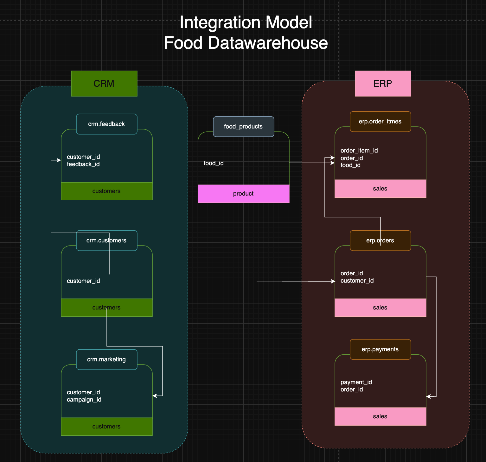

###### 🛠️ Skills & Technologies Used

        

# 🏠 Food Data Warehouse

This project showcases an end-to-end data warehousing solution built using **SQL Server** and follows the **Medallion Architecture** (Bronze, Silver, Gold). It simulates a retail food business by consolidating synthetic ERP and CRM data sources into a robust, analytics-ready **star schema**.

Designed as a portfolio project, it demonstrates real-world practices in **data engineering**, **ETL**, **data modeling**, and **analytical querying**, serving as a powerful resource for data-driven decision-making.

---

## ⚙️ Architecture

The warehouse follows the **Medallion Architecture**:

### 📥 Bronze Layer

- Raw ingestion from **CRM** and **ERP** systems in `.csv` format
- No transformation applied
- Stored in raw form for traceability

### 🔄 Silver Layer

- Cleansed, standardized, and transformed data
- Data quality issues resolved
- Structured for integration

### ✨ Gold Layer

- Star schema modeled for analytics
- Fact table: `fact_sales`
- Dimensions: `dim_customers`, `dim_products`
- Optimized for reporting and business insights

###### Data Architecture



###### Data mart design



###### Data Integration



---

## 📖 Project Goals

- Ingest and unify data from multiple sources (ERP + CRM)
- Implement ETL pipelines for each schema layer
- Design a star schema for analytics
- Generate valuable business insights using SQL
- Visualize insights using Tableau dashboards

---

## 🧱 Gold Layer Tables

| Table Name      | Description                       |
| --------------- | --------------------------------- |
| `dim_customers` | Customer demographics and profile |
| `dim_products`  | Product attributes and categories |
| `fact_sales`    | Transactions and order metrics    |

### Example: Star Schema

```cmd
        dim_customers
               |
               |
          fact_sales
               |
               |
         dim_products
```

---

## 📊 Gold Layer – EDA Health Check Summary (Food Data Warehouse)

This document outlines the initial EDA (Exploratory Data Analysis) performed at the schema level for the `gold` layer of the Food Data Warehouse. The objective is to ensure the structure, integrity, and readiness of dimensional and fact tables for analytics and reporting.

---

## 🔸 Schema: `gold`

### ✅ Purpose

- This schema represents the **final curated layer** used for reporting and dashboarding.
- Tables follow a **star schema model**, with surrogate keys, dimensional descriptors, and additive fact measures.

---

## 🧪 EDA Highlights

- ✅ All tables follow dimensional modeling best practices.
- ✅ Surrogate keys are in place for all tables.
- ⚠️ Apply foreign key checks manually (PostgreSQL doesn't enforce FKs across layers unless specified).
- ⚠️ Validate business logic (e.g., totals, date order, null distributions) using SQL profiling.

---

## 📍 Next Steps

1. **Run null checks** on key descriptive fields.
2. **Validate relationships** between fact and dimensions.
3. **Standardize** text-based fields (`category`, `channel`, `engaged`, `payment_method`).
4. Optionally, create automated data tests using:
   - `dbt` for integrity tests
   - `Great Expectations` for profiling and validation
   - Custom SQL scripts for business rule assertions

---

> 🧠 This markdown serves as an **EDA summary** for documentation and QA. Use it as a living checklist for data engineers and analysts to validate your gold layer.

---

## Repository Structure

```cmd
.
├── products.csv                   # Product data
├── sales.csv                      # Sales transaction data
├── License                        # Project license (e.g., MIT)
├── Procedures/                    # ETL procedures for data loading
│   ├── bronze_layer_batch.sql     # ETL batch script for Bronze layer
│   ├── main.sql                   # Main SQL script for the project
│   └── silver_layer_batch.sql     # ETL batch script for Silver layer
├── project/                       # Project-related files and analysis
│   └── Business_analysis/         # Business logic & insight generation
│       ├── advance_analysis.sql   # Advanced analysis SQL script
│       └── complex_analysis.sql   # Additional complex analysis script
├── assets                         # Project images and visuals
│   ├── Integration_food_dataset.png
│   └── integration_model.png
├── Business_Analysis              # SQL analysis for business insights
│   ├── complex_analysis_1.sql
│   └── complex_analysis_2.sql
├── CSV                             # Raw data files
│   ├── dim_customer.csv
│   ├── dim_products.csv
│   └── fact_sales.csv
├── EDA                             # Placeholder for exploratory data analysis
├── food_DB                         # Source database files (CRM & ERP data)
│   ├── crm_customers.csv
│   ├── crm_feedback.csv
│   ├── crm_marketing.csv
│   ├── erp_order_items.csv
│   ├── erp_orders.csv
│   ├── erp_payments.csv
│   └── food_products.csv
├── Gold                            # SQL for Gold Layer tables and views
│   ├── god_layer_tables.sql
│   └── gold_layer_view.sql
├── License                         # Licensing information
├── procedures                      # Data transformation batch processes
│   ├── bronze_layer_batch.sql
│   └── silver_layer_batch.sql
├── python                          # Python scripts for data processing
│   └── main.py
├── readme.md                       # Project overview and setup instructions
├── requirements.txt                # Python packages needed for the project
├── script                          # SQL DDL scripts for database schema
│   ├── ddl_bronze.sql
│   ├── ddl_gold_layer.sql
│   ├── ddl_silver_layer.sql
│   └── index.sql
├── todo.todo                       # Project task tracking file


```

## 🪪 License

This project is licensed under the [MIT License](LICENSE). You are free to use, modify, and share this project with proper attribution.

## About Me

Hi there! I'm a data science professional with a background in aeronautical engineering, now transitioning into marketing analytics. With a strong foundation in analytical thinking and data-driven decision-making, I've worked on a range of data science projects, including predictive modeling, ETL pipelines, and data warehousing.

Currently, I focus on:

- Building and optimizing ETL pipelines.
- Working with large-scale databases and performing advanced data analysis.
- Using tools like SQL, Python, and Tableau to extract actionable insights from data.

I enjoy exploring new technologies in machine learning, AI, and deep learning. My approach is hands-on, and I love learning by doing — whether it's building machine learning models or fine-tuning complex data pipelines.

### Current Projects:

- Developing a predictive model to understand customer behavior.
- Implementing an advanced data pipeline to optimize data workflows.
- Working on various marketing analytics projects to drive business decisions.

Feel free to connect or check out my previous projects!
[Data warehouse project](https://github.com/Saquib-Hazari/sql-data-warehouse-project?tab=readme-ov-file)

## Connect with Me

[](https://www.linkedin.com/in/saquib-hazari/) [](https://x.com/saquib7298) [](https://discord.gg/FJBZBbgC) [](<[https://YOUR_WEBSITE.com](https://saquibhazari-portfolio.vercel.app/)>) [](mailto:your-email@gmail.com)
